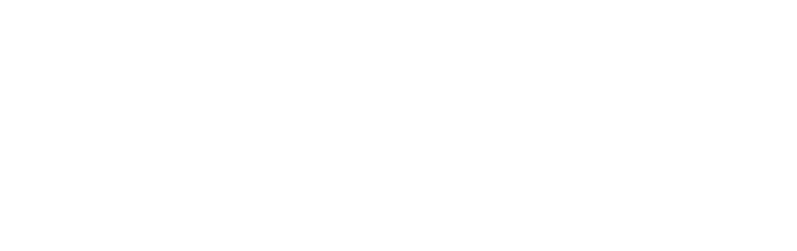

---
# ══════════════════════════════════════════════════════════════
# PLANTILLA DE PRESENTACIÓN DE TESIS
# Universidad Nacional de Loja
# Facultad de la Energía, Las Industrias y los Recursos Naturales No Renovables
# Carrera de Computación
#
# INSTRUCCIONES:
#   1. Reemplaza los textos entre «» con tu información
#   2. Renderiza con: quarto preview presentacion-tesis.qmd
#   3. Para exportar PDF: usa la opción de imprimir del navegador (Ctrl+P)
# ══════════════════════════════════════════════════════════════
format:
  revealjs:
    theme: [default, css/unl-theme.css]
    logo: assets/logoUnlOscuro.png
    slide-number: true
    transition: fade
    transition-speed: fast
    background-transition: fade
    width: 1280
    height: 720
    margin: 0.08
    center: false
    hash: true
    history: true
    controls: true
    progress: true
    touch: true
    lang: es
    highlight-style: monokai
    title-slide: false
    include-in-header:
      text: |
        
---

<!-- ═══════════════════════════════════════════════════════════
     SLIDE 1: PORTADA PRINCIPAL
     ═══════════════════════════════════════════════════════════ -->

## {.portada data-state="portada" data-menu-title="Portada" data-background-color="#FFFFFF"}

::: {.portada-panel-rojo}

:::

::: {.portada-panel-blanco}

Universidad Nacional de Loja

Facultad de la Energía, Las Industrias y los Recursos Naturales No Renovables · Carrera de Computación

<h2 class="cover-titulo">«Título de tu Trabajo de Tesis aquí»</h2>

Autor «Nombre del Estudiante»

Director «Nombre del Director de Tesis»

Loja – Ecuador «Año»

:::

<!-- ═══════════════════════════════════════════════════════════
     SLIDE 2: ÍNDICE / CONTENIDO
     ═══════════════════════════════════════════════════════════ -->

## Índice {.indice data-menu-title="Índice"}

- Tema de Investigación
- Introducción
- Planteamiento del Problema
- Objetivos (General y Específicos)
- Metodología
- Resultados
- Discusión
- Conclusiones
- Recomendaciones

<!-- ═══════════════════════════════════════════════════════════
     OPCIONAL: SLIDE DE SECCIÓN (fondo rojo, sin cabecera)
     Descomenta y duplica donde quieras separar bloques.
     IMPORTANTE: incluye siempre data-state="portada" para
     ocultar la línea roja, el logo y el pie de página.

## Nombre de la Sección {.seccion data-state="portada"}

01

     ═══════════════════════════════════════════════════════════ -->

<!-- ═══════════════════════════════════════════════════════════
     SLIDE 3: TEMA
     ═══════════════════════════════════════════════════════════ -->

## Tema de Investigación

<!-- EDITAR: Escribe aquí el título completo del tema de tu tesis -->

> «Título completo del trabajo de titulación tal como aparece en el documento aprobado»

::: {.caja-info}
**Línea de investigación:** «Especificar la línea de investigación»
:::

<!-- ═══════════════════════════════════════════════════════════
     SLIDE 4: INTRODUCCIÓN
     ═══════════════════════════════════════════════════════════ -->

## Introducción

<!-- EDITAR: Breve contexto del trabajo de investigación (3-5 párrafos cortos) -->

- «Contexto general del área de estudio»

- «Relevancia del problema a investigar»

- «Breve mención del enfoque metodológico adoptado»

- «Aporte principal del trabajo»

<!-- ═══════════════════════════════════════════════════════════
     SLIDE 5: PROBLEMÁTICA Y OBJETIVOS
     ═══════════════════════════════════════════════════════════ -->

## Planteamiento del Problema

<!-- EDITAR: Describe la problemática que aborda tu investigación -->

- «¿Cuál es el problema identificado?»

- «¿A quién afecta y de qué manera?»

- «¿Qué consecuencias genera si no se aborda?»

::: {.caja-importante}
**Problema central:** «Describir de forma concisa el problema central de la investigación»
:::

---

## Objetivos

### Objetivo General

<!-- EDITAR: Tu objetivo general -->

- «Objetivo general de la investigación»

### Objetivos Específicos

<!-- EDITAR: Tus objetivos específicos -->

1. «Primer objetivo específico»
2. «Segundo objetivo específico»
3. «Tercer objetivo específico»

<!-- ═══════════════════════════════════════════════════════════
     SLIDE 6: METODOLOGÍA
     ═══════════════════════════════════════════════════════════ -->

## Metodología

<!-- EDITAR: Describe tu enfoque metodológico -->

### Tipo de Investigación

- «Tipo de investigación (descriptiva, exploratoria, experimental, etc.)»
- «Enfoque (cualitativo, cuantitativo, mixto)»

### Técnicas e Instrumentos

- «Técnicas de recolección de datos utilizadas»
- «Instrumentos aplicados (encuestas, entrevistas, observación, etc.)»

---

## Metodología — Herramientas

<!-- EDITAR: Tabla con las herramientas usadas. Agrega o quita filas según necesites -->

| Herramienta | Propósito | Versión |
|-------------|-----------|---------|
| «Herramienta 1» | «Propósito» | «Versión» |
| «Herramienta 2» | «Propósito» | «Versión» |
| «Herramienta 3» | «Propósito» | «Versión» |

---

## Metodología — Población y Muestra

<!-- EDITAR: Información sobre población y muestra (si aplica) -->

- **Población:** «Describir la población de estudio»
- **Muestra:** «Tamaño y tipo de muestreo»
- **Criterios de inclusión:** «Criterios»
- **Criterios de exclusión:** «Criterios»

<!-- ═══════════════════════════════════════════════════════════
     SLIDE 7: RESULTADOS
     ═══════════════════════════════════════════════════════════ -->

## Resultados — Objetivo 1

<!-- EDITAR: Resultados del primer objetivo específico -->

### «Título descriptivo del resultado»

- «Hallazgo principal»
- «Datos relevantes o métricas»

<!-- TIP: Puedes insertar imágenes de gráficos o tablas así:
{width="70%"}
-->

---

## Resultados — Objetivo 2

<!-- EDITAR: Resultados del segundo objetivo específico -->

### «Título descriptivo del resultado»

- «Hallazgo principal»
- «Datos relevantes o métricas»

---

## Resultados — Objetivo 3

<!-- EDITAR: Resultados del tercer objetivo específico -->

### «Título descriptivo del resultado»

- «Hallazgo principal»
- «Datos relevantes o métricas»

<!-- ═══════════════════════════════════════════════════════════
     SLIDE 8: DISCUSIÓN
     ═══════════════════════════════════════════════════════════ -->

## Discusión

<!-- EDITAR: Análisis e interpretación de resultados -->

- «¿Cómo se relacionan tus resultados con la literatura existente?»

- «¿Qué hallazgos coinciden o difieren de estudios previos?»

- «¿Cuáles son las implicaciones de tus resultados?»

::: {.caja-info}
**Comparación clave:** «Contrasta tu resultado más importante con un estudio de referencia»
:::

<!-- ═══════════════════════════════════════════════════════════
     SLIDE 9: CONCLUSIONES
     ═══════════════════════════════════════════════════════════ -->

## Conclusiones

<!-- EDITAR: Conclusiones alineadas con los objetivos -->

1. «Primera conclusión — vinculada al objetivo específico 1»

2. «Segunda conclusión — vinculada al objetivo específico 2»

3. «Tercera conclusión — vinculada al objetivo específico 3»

::: {.caja-importante}
**Conclusión general:** «Síntesis de la conclusión general de la investigación»
:::

<!-- ═══════════════════════════════════════════════════════════
     SLIDE 10: RECOMENDACIONES
     ═══════════════════════════════════════════════════════════ -->

## Recomendaciones

<!-- EDITAR: Recomendaciones basadas en los hallazgos -->

1. «Primera recomendación»

2. «Segunda recomendación»

3. «Tercera recomendación»

4. «Cuarta recomendación (trabajos futuros)»

<!-- ═══════════════════════════════════════════════════════════
     SLIDE 11: PORTADA FINAL
     ═══════════════════════════════════════════════════════════ -->

## {.portada-final data-state="portada" data-menu-title="Cierre" data-background-color="#E30613" data-background-gradient="linear-gradient(135deg, #E30613 0%, #B8050F 60%, #8B0000 100%)"}

<h2>Gracias por su atención.</h2>

«Nombre del Estudiante» — Universidad Nacional de Loja

